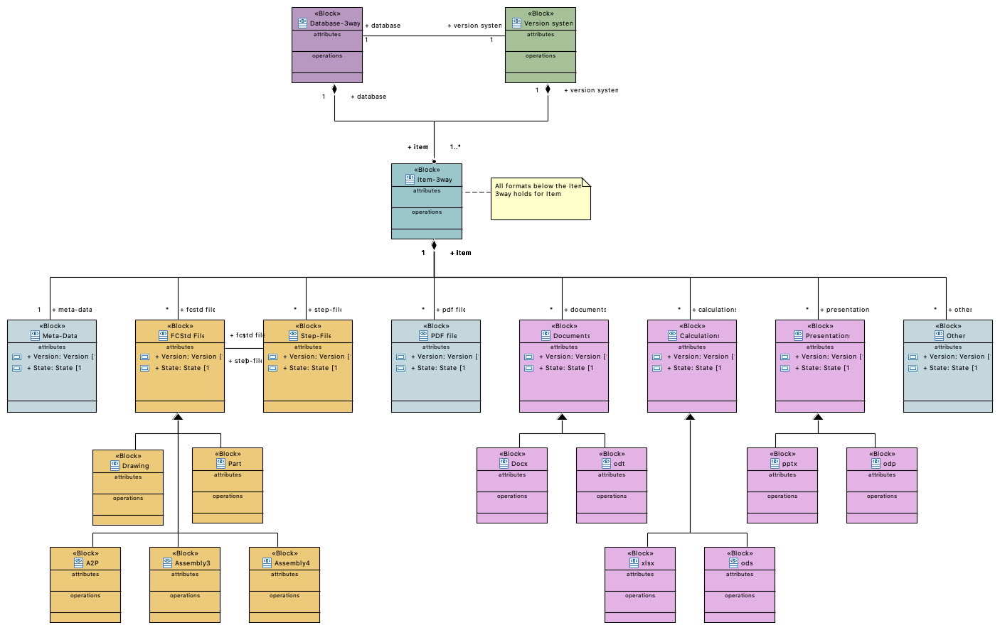
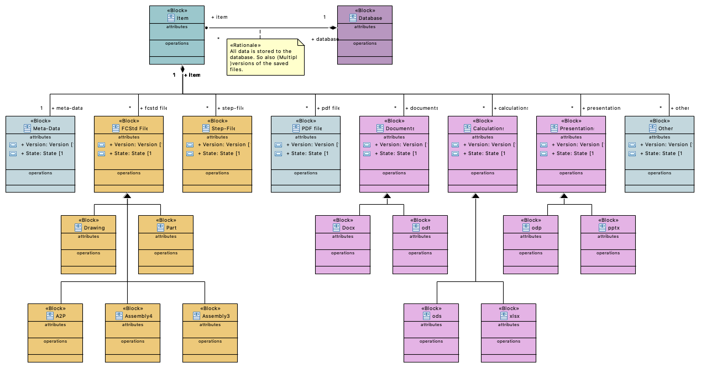
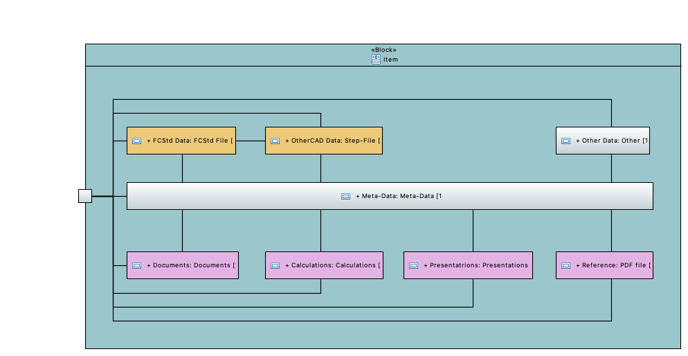

# FreePDM
***Concept Of Design***

## Update Database Version Methods

### Introduction

There is a lot of research needed to know what the best way is to handle location, version management and database management.
This work here is an extension on the work done [here](FreePDM_03-2-SVNProjectStructure.md).

### Tree way system

#### General

First an explanation about the context see [diagram](BDD-Item-3Way) below.
The _Item_ is the base building block for everything.
The _Item_ connect to the database, to the versioning system.
At the same time the _Item_ holds all , like CAD files, Documents etc.
(See all the 'blocks' that hang below the item).  
_Note: A  Triangle arrow means general case.
So a document is a general case and a docx file is a special case of a document._

The next diagram is to create a better understanding what happens inside the _Item_ 'block'.

In this diagram everything is a bit more general.
So all the special cases are ignored.
There are _Connections_ between the different files and the _meta-data_.
This are data transfers between the files / based on the files and the _Meta-Data_('local' _Database_) of the _Item_.  
From the _Meta-Data_ there is a _Connection_ to the right side of the _Item_.
All Other Files have a _connection_ to the left side of the _Item_.
What this mean are explained in [Interfaces](#interface).

#### Interface

Basically an _Interface_ show what systems talk to each other / Need information from each other.
In the diagram below show the _Interfaces_ between the _Item_, _Database_ and _Versioning System_.

If we go back to the _Item_ block there we have two _Interfaces_. These two _Interfaces_ correspond with the diagram directly above.  
As all the _Rationale_ and _Problems_ explain there are some difficulties to overcome.  
The main issue is split between the _Version system_ and the _database_. 
In this split lies the solution to handle binary files where most version system fall short.
Binary files are in such a system basically all copies and not delta files what it is with text files.

### two way system

#### General

There are two alternatives in a two way system that walk side by side.
The first alternative that is part of this whole research.
The second alternative drops in by the [_Interface_](#Interface).  
Below a diagram that is almost equal to the equivalent diagram in the [tree-way](#Tree-way-system) method.
The difference is the missing _Version System_.

The next diagram is to create a better understanding what happens inside the _Item_ 'block'.

But as you can see there is now a single interface.
Both the files and the _Meta-data_ goes to the the same 

#### Interface

Here is where the two alternatives diverge.
The divergence have also change inside the _Item_ block as result.
But what that is follows later.

First we ignore the _LDAP-server_.
What do we see then:  
All data goes to the _Database_, Some part directly(The binary Files) and some via the _Meta-Data_.

It is possible to add _Binary_ _Data_ to a _SQL-server_. Normally a database have a known width(call it that way) and grows only length wise.
In this case we have an unknown amount of versions (of every _CAD_ _File_) that are stored.
With this method the _Database_ expand in both directions.
For comparison with preview images.
A preview image in the _Database_ is fine since every item gets a single image.
The history of images is not important so only the last version needs access to the database. 
If the preview change the existing file is overwritten.
So the size of the table don't expand.

Now the second alternative.
The _LDAP-server_ is now taken into account.

What is a _LDAP-server_?
According to Okta (See What is LDAP) LDAP is the following:

> LDAP is an open, vendor-neutral application protocol for accessing and maintaining that data. 
> LDAP can also tackle authentication, so users can sign on just once and access many different files on the server.

First a comparison between a _svn-server_ and a _LDAP-server_:

_svn-server_                | _LDAP-server_
----------------------------|-----------------------------------
Handles changes of text files  | Don't Handle changes explicitly
Changes binary data are copies | Don't Handle changes explicitly
Handles Versions on project level | Don't Handle versions explicitly
Don't handle Authentication | Handle Authentication
Don't work together with an _Database_ | Able to work together with a _Database_
Work on project level.      | Work multi level

Basically both methods solve two different problems
Both methods are not able to work together(at least not out of the box).
Where a _svn-server_ handles _Versions_ specially on text base projects.
A _LDAP-server_ mainly Handles _Folder_, _File_ access in a _Folder_, _File-Structure_ and [static](https://backboneplm.com/tech-packs-static-data-vs-dynamic-data/) Data.
Since _CAD-Files_ are mainly (Static )_Binary Files_ it is much more difficult to handle _Versions_.
Even for a _svn-server_ it are basically copies, and thus it looses part of its power.

If we go now to the internals of an _Item_.
In the situation without _LDAP-server_ (as shown)all files are synchronised with the _Database_. 
In the version with _LDAP-server_ is much more easy. Only the _Meta-Data_ is synchronised with the _Database_ because the data itself is part of the _LDAP-server_.
This makes this implementation less difficult.  
Another pro of this implementation is that it is widely used by other PLD / PDM systems.
See for reference by the [Additional information](#additional-information).

The versioning is not handled by this system.
Since _CAD-Files_ are binary files it is equally problematic as with a versioning system (that also create copies).  
Every time one or more files are _Checked-In_ the following steps are performed:

1. Request Access to _LDAP-Server_
2. Modify Entry what result in
  1. Make copy of existing _<filename>.FCStd_ to _<filename>.FCStd#_
  2. Create New database version (for look back)
  3. Overwrite _<filename>.FCStd_ with the changed _File_ from the _User_.
3. Optionally _Check-Out_ (== request authentication)again.
4. Loose Access to _LDAP-Server_ (So no constant access to the server is required)

For 1.1 we use the same scheme that FreeCAD uses for saving backup files.
Here is the _#_ a number that is added in the _File-Extension_ as _FCStd#_.
This way a _User_ or _Admin_(can be decided on _Server_ level) is always able to go back to a previous stored versions.
Every _Released_ _Version_ is a dedicated file on the server what never leads to trouble.
Also a _Base-Line_(A important stored _Version_ without a _Release Status_) can be created.
If preferred all versions that are stored before a _Release_ can be removed at the moment of a creating a _Revision_.

#### Additional information

LDAP server in general

- [LDAP wikipedia](https://en.wikipedia.org/wiki/Lightweight_Directory_Access_Protocol)
- [What is LDAP](https://www.okta.com/identity-101/what-is-ldap/)
- [Open source LDAP server](https://opensource.com/business/14/5/four-open-source-alternatives-LDAP)
- [Difference between SQL and LDAP](https://stackoverflow.com/questions/5075394/difference-between-sql-and-ldap#5075461)

Microsoft Active directory

- [ldap vs ad](https://www.okta.com/identity-101/ldap-vs-active-directory/)
- [Microsoft Configure Active Directory](https://docs.microsoft.com/en-us/sql/linux/sql-server-linux-ad-auth-adutil-tutorial?view=sql-server-ver16)
- [Microsoft Active Directory course](https://docs.microsoft.com/en-us/learn/paths/active-directory-domain-services/) 

Implementation

- [Static vs dynamic data](https://backboneplm.com/tech-packs-static-data-vs-dynamic-data/)
- [Joining an LDAP Directory and a MySQL Database](https://docs.oracle.com/cd/E19424-01/820-4809/sample-virtual-config1/index.html)

It looks like That Windchill, Teamcenter AND SolidWorks PLM use a combination of SQL server && LDAP server.

- [Creo LDAP](https://community.ptc.com/t5/Windchill/what-is-the-purpose-of-Method-server-Server-Manager-and-LDAP/td-p/211635
)
- [Teamcenter LDAP question](https://community.sw.siemens.com/s/question/0D54O000061xshJSAQ/teamcenter-sso-setup-unknown-ldap-exception)
- [Solid Works LDAP](https://help.solidworks.com/2022/english/enterprisepdm/archiveserver/c_Login_Settings.htm)

Databases and storing binary data.

- [binary data types in sql server](https://www.thoughtco.com/binary-data-types-in-sql-server-1019807)
- [storing binary data types in sql server](https://codingsight.com/storing-binary-data-types-in-sql-server/)
- [my-SQL binary varbinary](https://dev.mysql.com/doc/refman/8.0/en/binary-varbinary.html)

### Conclusion

From the three Alternatives looks it like the system version without _Versioning System_ and with _LDAP-server_ is implementation wise the best option.  
Is the _LDAP-server_ always required?
Maybe not for small companies where _ALl_ users have access to everything. As long a file and folder structure can be maintained.

[<< Previous Chapter](FreePDM_03-2-SVNProjectStructure.md) | [Content Table](README.md) | [Next Chapter >>](FreePDM_04-Requirements.md)
