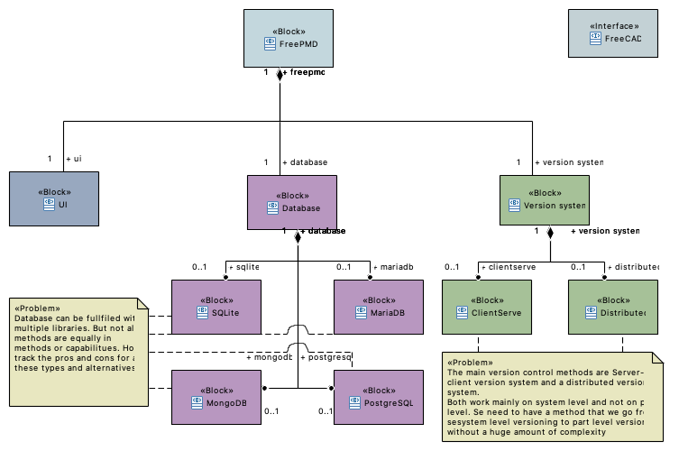
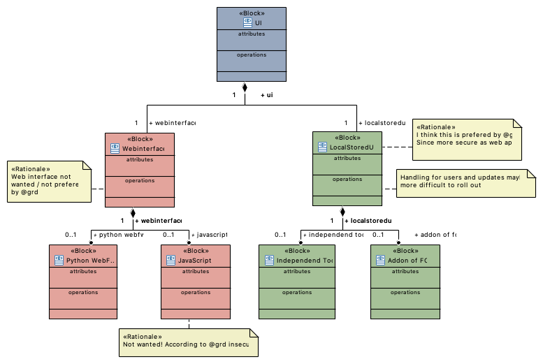

# FreePDM
***Concept Of Design***

## Design decisions

- Version management see:
- User interface
- Database
- Used programming language
- Attributes

### General setup

### Version management

Version management is a difficult topic. A main issue is that it should be able to create releases of every individual part, assembly (and optional drawing.)  

There are serval different (Open source)version control systems available. But there are also closed source versions. I think that we should also accept those because in a company they might only allow this kind of software.
The main difficulty is that those are most written for software.  
Where software is released as a whole that is not always the case within the mechanical world. see: @ref to story

This has to be tackeled. Why does it need to be tackled? You can also allow them all. But in that case we need to hav an admin page in where we can select which one we use. They all work roughly the same, but we need to make all work of course. But we are gonna start with SVN.

Currently the most promissing implementation is the svn version system (a Client-server).  
The most wel known Distributed version systems are [git](https://git-scm.com/) and [mercurial](https://www.mercurial-scm.org/).

_Note: We have to decide if the model(part / assembly) get's an update,  the drawing get also an update. The same issue applied in revers order._
This is never gonna work. When a part is changed you aso need to update the drawing of that part, the assy (or assy's) in where it belongs and the drawings of those too.

### Database

Within databases there are two main types of databases.
[SQL](https://en.wikipedia.org/wiki/SQL) based databases. Examples of SQL like databases are [SQLite](https://sqlite.org/index.html), [MariaDB](https://mariadb.org/), [PostgreSQL](https://www.postgresql.org/). 
<!--On https://sqlite.org/fileformat2.html is written:-->
<!--The main database file consists of one or more pages. The size of a page is a power of two between 512 and 65536 inclusive. All pages within the same database are the same size. The page size for a database file is determined by the 2-byte integer located at an offset of 16 bytes from the beginning of the database file.-->  
<!--Does this mean that it basically a big spreadsheet?-->

The other is [noSQL](https://en.wikipedia.org/wiki/NoSQL). An example of this database is [MongoDB](https://www.mongodb.com/)

_Note: Add What the difference is and how such a database is build up_

Why do we need such a database? That is the question. We need it because we can't extract the relevant information out of VCS and that is because a FC file attributes are stored somewhere into that file. And you want to be able to search that metadata information. To be honest, I don't care about which kind of software you use (SQL / noSQL), but https://en.wikipedia.org/wiki/SQLAlchemy helps a lot when you use SQL data. That is why I think that we better use SQL. Starting with sqlite.

### User interface

For the user interface there are two main issues buth both are related. the issue about the programming language is described below.

### Used programming language

### [Attributes](Attributes.md)

[<< Previous Chapter](FreePDM_02-Workflows.md) | [Content Table](FreePDM_00-CoD.md) | [Next Chapter >>](FreePDM-03-1-Attributes.md)
