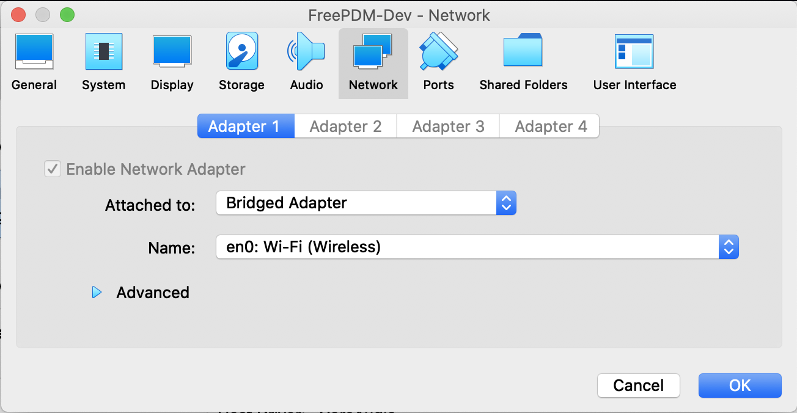
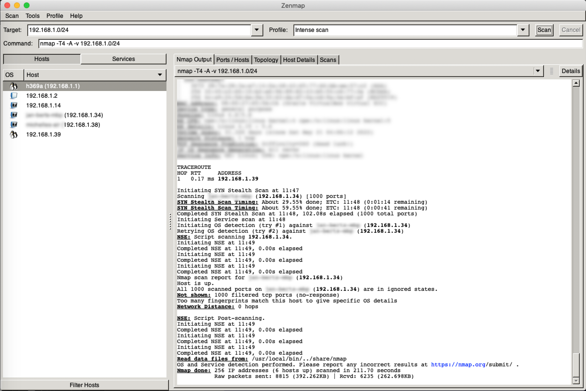
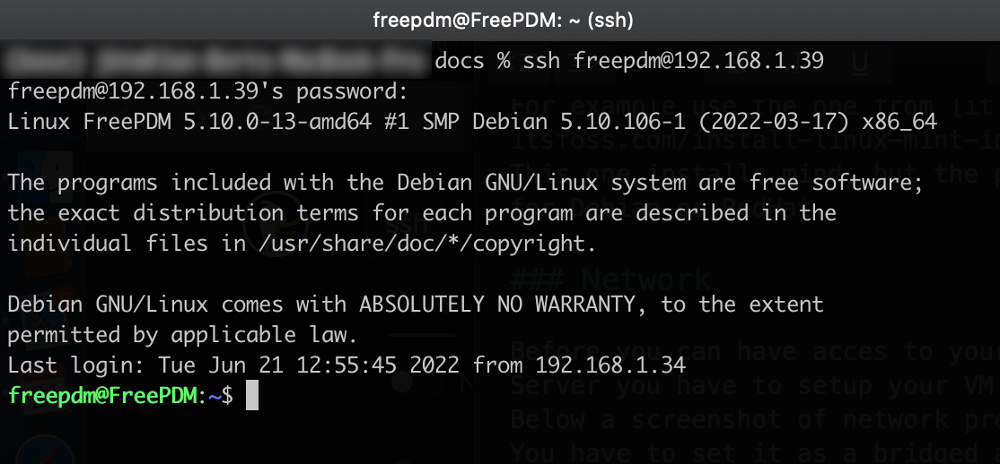

## FreePDM Documentation

## Setup VirtualBox

### General

For setting up a Virtual Machine (VM) in VirtualBox there are multiple tutorials out in the wild.
For example use the one from [it's foss](https://itsfoss.com/install-linux-mint-in-virtualbox/).
This example is for Linux Mint specifically but the principles are the same for Debian, RedHat and other distros.

### Network

Before you can have access to your VM/Server you have to setup your VM network.
Below is a screenshot of the network preference page.
You have to set it as a 'bridged adapter' and set its name to the network adapter that:

1. your system is using
2. a second adapter that also has network access.



In this case the standard network adapter is used.

You can check with [_nmap_](https://nmap.org) if you can see that the VM has access to your network.  
If you compare both _IP addresses_ (one from _nmap_ and one from [setup static ip address](#setup-static-ip-address)) that both _IP addresses_ are the same.  
Now you can access your VM via [ssh](#ssh)



### Setup static IP address

A static IP address is an address that doesn't change (as opposed to dynamic IP addresses). Setting up a _static_ _IP address_ is recommended, but not required.
If preferred to leave the _IP address_ as is, see below how to check your _IP address_.
For changing the _IP address_ to _static_ one see for example [this blog](https://www.rosehosting.com/blog/how-to-configure-static-ip-address-on-ubuntu-20-04/) or [here](https://linuxconfig.org/how-to-setup-a-static-ip-address-on-debian-linux).

How to check your _IP address_:  
The command `ip -a | grep inet` gives your current (local) _IP address_.

You can access this your server from your _terminal_ or via _Putty_. 

### `ssh`

_ssh_ is a  Secure Shell protocol.
As long as you have installed it on both your server and on you system you should be able to remote login.

Login works as follows:

```shell
ssh USERNAME@###.###.###.###
```

Then type in your password. 



Note: if this is the first time connecting via `ssh` you'll be prompted to confirm and accept ssh key 'handshake'. Please agree to this. On subsequent logins this will not be displayed. 

Now you are ready to go.

[<< Previous Chapter](commands.md) | [Content Table](README.md) | [Next Chapter >>]()
